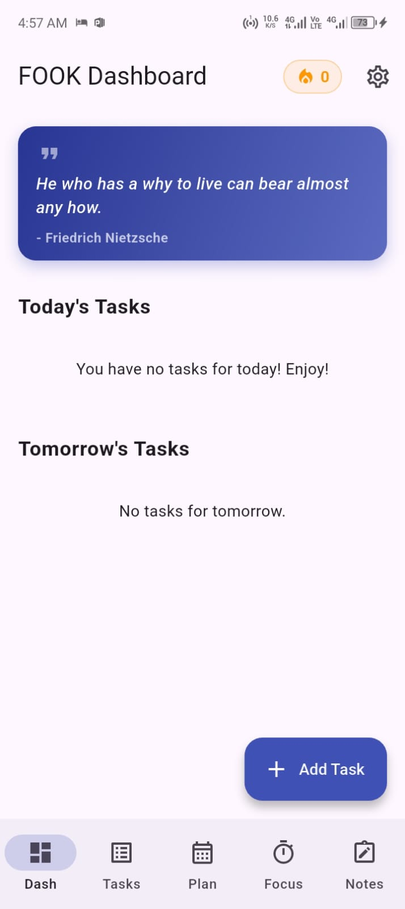
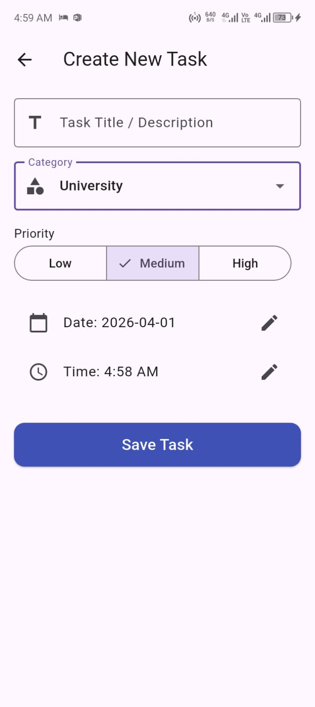
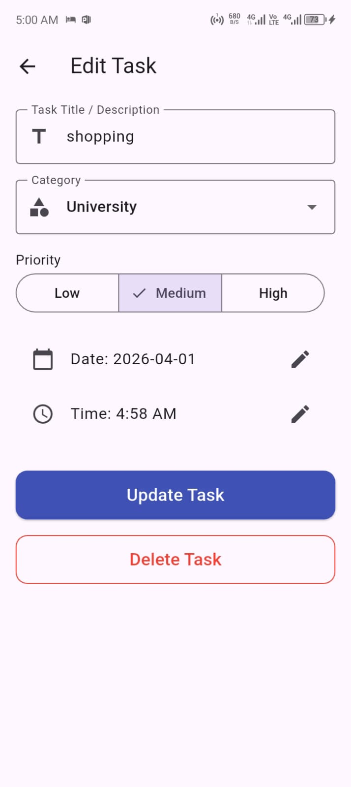
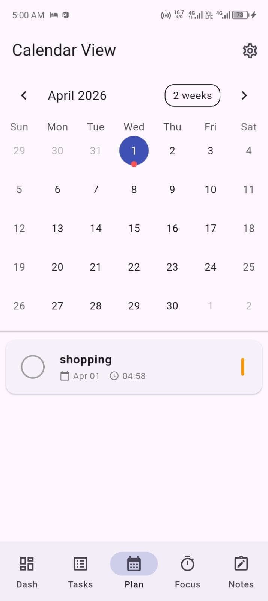
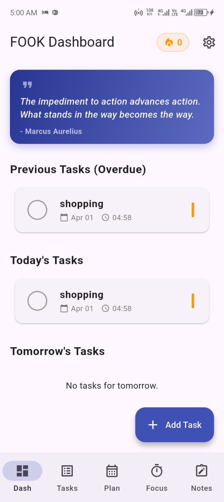

# FOOK - Framework Of Organized Knowledge

[](https://flutter.dev)
[](https://dart.dev)
[](https://opensource.org/licenses/MIT)

**FOOK** is a premium, offline-first productivity companion designed to help you stay organized, focused, and secure. Built with Flutter, it combines a powerful Task Manager, a clean Notepad, a productive Focus Timer, and an integrated Calendar into a single, cohesive experience.

---

## 📸 Visual Showcase

| Welcome | Dashboard | Task Manager |
| :---: | :---: | :---: |
|  |  |  |

| Focus Timer | Notes | Calendar |
| :---: | :---: | :---: |
|  |  |  |

---

## ✨ Key Features

### 🚀 Smart Dashboard
- **Dynamic Quote Header**: Get inspired with daily curated quotes.
- **Task Overview**: Immediate visibility into Overdue, Today, and Tomorrow's tasks.
- **Activity Streak**: Stay motivated with a visual fire-streak indicator of your consistency.

### 📅 Advanced Task Management
- **Exact Reminders**: Set precise notifications that wake your device even when idle.
- **Flexible Scheduling**: Easily plan ahead with the integrated task manager and calendar view.
- **Click-to-Edit**: Seamlessly update task details with an intuitive HCI-compliant interface.

### ⏱️ Productivity Focus Timer
- **Custom Durations**: Set your focused work intervals.
- **Visual Feedback**: Real-time progress tracking to maximize deep work sessions.

### 📝 Integrated Notepad
- **Quick Capture**: Write down ideas and notes instantly.
- **Organized List**: Manage multiple notes with a clean, searchable interface.

### 🔐 Multi-Layer Security
- **App Lock**: Protect your data with a secure PIN.
- **Biometric Authentication**: Seamless access using Fingerprint or Face ID.
- **Offline First**: Your data stays on your device—no cloud syncing, no privacy leaks.

---

## 🛠️ Technical Stack

- **Framework**: [Flutter](https://flutter.dev)
- **State Management**: [Provider](https://pub.dev/packages/provider)
- **Database**: [SQLite (sqflite)](https://pub.dev/packages/sqflite)
- **Local Storage**: [Flutter Secure Storage](https://pub.dev/packages/flutter_secure_storage)
- **Notifications**: [Flutter Local Notifications](https://pub.dev/packages/flutter_local_notifications)
- **Background Tasks**: [Android Alarm Manager Plus](https://pub.dev/packages/android_alarm_manager_plus)

---

## 🚀 Getting Started

### Prerequisites
- Flutter SDK (Stable channel)
- Android Studio / VS Code with Flutter extension

### Installation
1. Clone the repository:
   ```bash
   git clone https://github.com/yourusername/fook.git
   ```
2. Install dependencies:
   ```bash
   flutter pub get
   ```
3. Run the app:
   ```bash
   flutter run
   ```

---

## 📄 License

This project is licensed under the MIT License - see the [LICENSE](LICENSE) file for details.

---

## 🤝 Contributing

Contributions are welcome! Please feel free to submit a Pull Request.

---

## ❤️ Credits

Developed with passion by **Developer Name**.
Check out my portfolio at [www.yourportfolio.com](http://www.yourportfolio.com)
